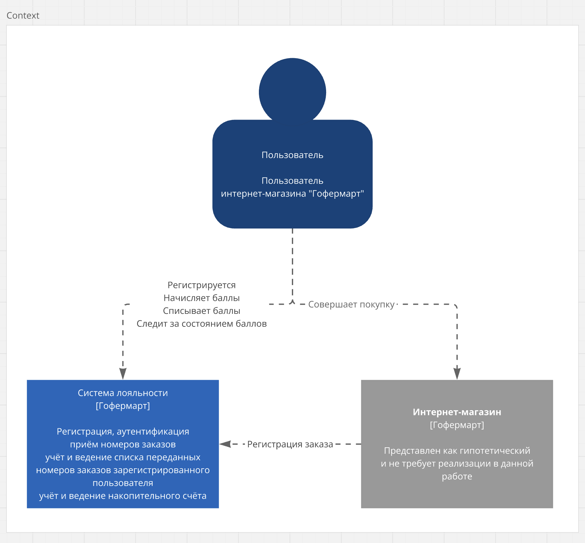
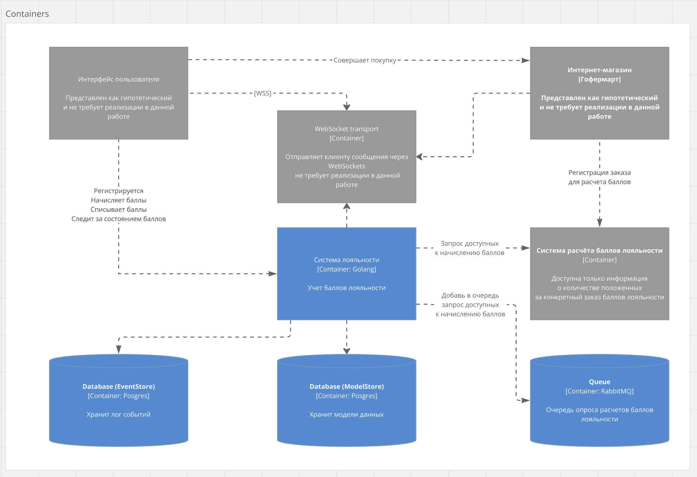
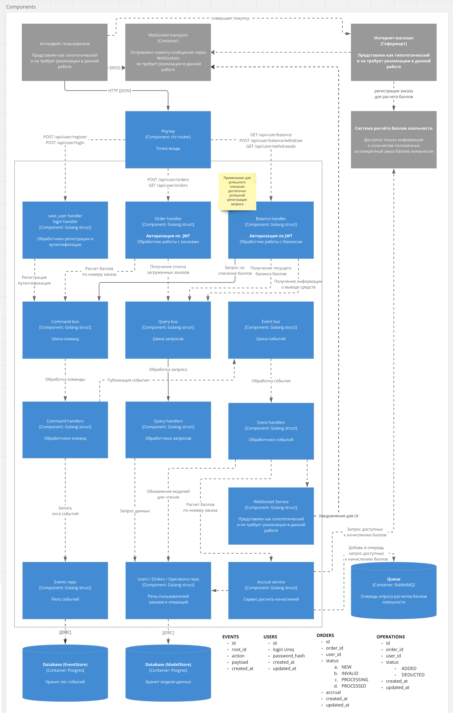

# Gmart

## Абстрактная схема взаимодействия с системой

Ниже представлена абстрактная бизнес-логика взаимодействия пользователя с системой:
* Пользователь регистрируется в системе лояльности «Гофермарт».
* Пользователь совершает покупку в интернет-магазине «Гофермарт».
* Заказ попадает в систему расчёта баллов лояльности.
* Пользователь передаёт номер совершённого заказа в систему лояльности.
* Система связывает номер заказа с пользователем и сверяет номер с системой расчёта баллов лояльности.
* При наличии положительного расчёта баллов лояльности производится начисление баллов лояльности на счёт пользователя.
* Пользователь списывает доступные баллы лояльности для частичной или полной оплаты последующих заказов в интернет-магазине «Гофермарт».

## Архитектура проекта

Проект реализует паттерн CQRS + Event Sourcing. Все меняющие состояние системы события регистрируются в таблице Events.
Общение с внешней системой по рассчету баллов лояльности осуществляется ассинхронно через очередь.
На порту 8082 доступен OpenApi.





## Структура проекта

    .
    ├── cmd                  # Основное приложение
    ├── internal             # Внутренний код
    │   ├── application      # Application layer
    │   │   ├── command        
    │   │   ├── dto         
    │   │   ├── event         
    │   │   ├── query         
    │   │   └── service
    │   ├── domain           # Domain layer
    │   ├── infrastructure   # Infrastructure layer
    │   │   ├── config        
    │   │   ├── db         
    │   │   ├── di         
    │   │   ├── dto   
    │   │   ├── handler   
    │   │   ├── httpclient   
    │   │   ├── httpserver
    │   │   ├── logger   
    │   │   ├── openapi   
    │   │   ├── queue   
    │   │   ├── repo   
    │   │   └── router
    │   ├── test             # End-to-end tests
    │   └── utils         
    └── ...

## Deploy

Создать в корне .env

```
SALT=                       # Соль для паролей пользователей
JWT_KEY=                    # Секрет для jwt
AMPQ=                       # uri для rabbit
ACCRUAL_SYSTEM_ADDRESS=     # uri системы расчета балов
DATABASE_URI=               # uri БД
RUN_ADDRESS=                
```

Запуск docker окружения

```shell
docker-compose up -d
```
